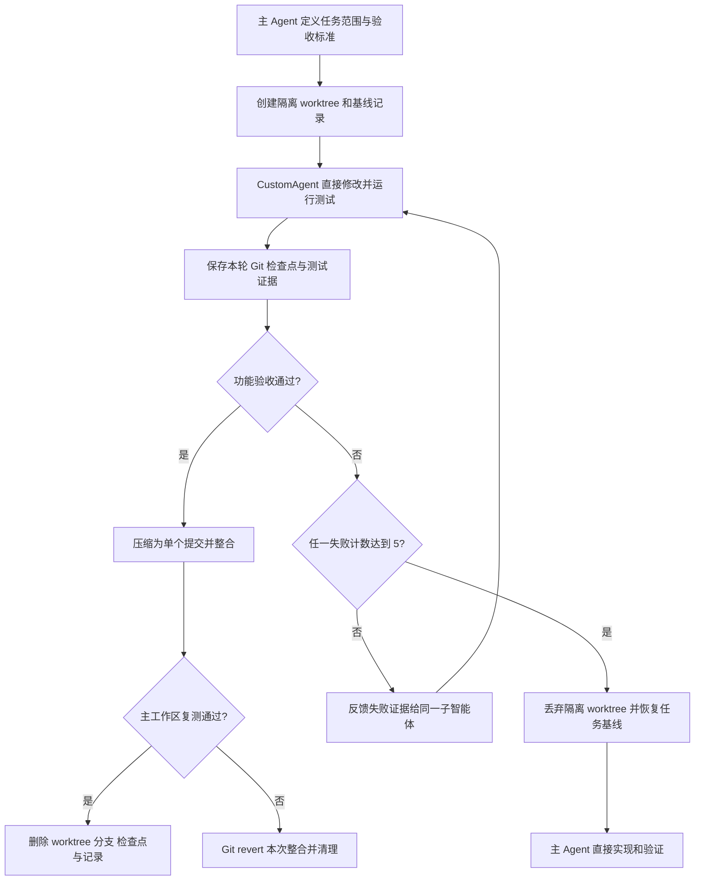

# 隔离写入工作流

主 Agent 不把活动检出直接交给可写子智能体。每个独立任务使用一个临时 worktree、一个任务分支和一个 Git 公共目录中的临时 manifest。



## 命令顺序

任务开始前，主工作区必须干净。`--summary` 与 `--acceptance` 只保存完成恢复所需的脱敏摘要，不保存 API Key 或无关完整对话。

```text
python3 scripts/task_worktree.py start --repo <repo> --task-id <id> --summary <summary> --acceptance <criteria> --path <scope> --json
```

把输出的绝对 `worktree` 路径和 `write_scopes` 交给 `CustomAgent`。每轮修改和验收后记录检查点：

```text
python3 scripts/task_worktree.py checkpoint --repo <repo> --task-id <id> --attempt <n> --note <feedback> --evidence <test-result> [--attempt-failed] [--parent-redirect] [--review-rejected] --json
```

验收通过时先整合，再在主工作区复测：

```text
python3 scripts/task_worktree.py integrate --repo <repo> --task-id <id> --evidence <accepted-test> --json
python3 scripts/task_worktree.py finalize --repo <repo> --task-id <id> --json
```

整合后复测失败时，只有主分支仍停留在该整合提交且工作区干净才允许自动 revert：

```text
python3 scripts/task_worktree.py rollback-integrated --repo <repo> --task-id <id> --json
```

第五次失败或主动终止时，主 Agent 运行 `abort`。该命令强制删除隔离 worktree 和任务分支，不修改主工作区，然后清理 manifest 与检查点：

```text
python3 scripts/task_worktree.py abort --repo <repo> --task-id <id> --json
```

## 安全不变量

- `start` 拒绝不干净的主工作区，不会自动 stash、提交、reset 或删除用户修改。
- 子智能体只能修改声明的写入范围。最终树存在越界文件时，`integrate` 拒绝执行。
- `integrate` 要求主工作区仍处于任务基线且干净，防止覆盖并发修改。
- 每次整合在主分支上只产生一个提交。中间失败版本只存在于临时任务分支。
- `finalize`、`abort` 和 `rollback-integrated` 完成后删除临时 worktree、任务分支、检查点和记录。
